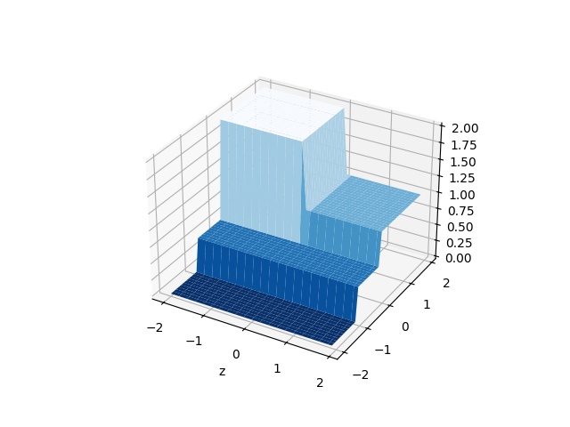
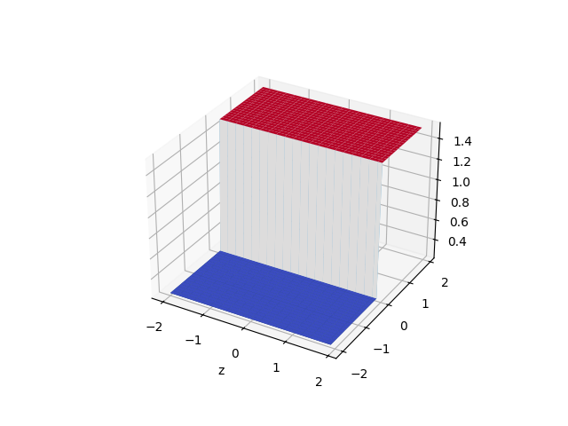
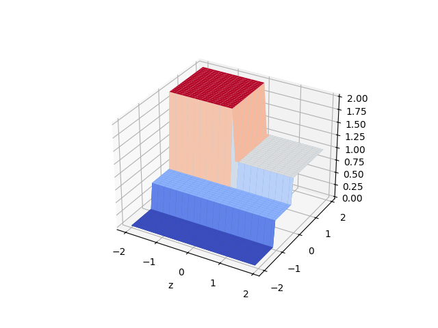

### Background
This implements parts of section 9 from Hastie, Tibshirani and Friedman, 2019, decision trees for regression.

### Set up
We set up a dummy 2d regression problem, and implement a binary regression tree.
The implementation has two broad components:

1. Finds optimal splits at each level of the tree as it grows
2. Attaches this data to a binary tree for easier pruning and prediction

The main parameter in main.py is the MAX_DEPTH, which will grow out a deeper tree as needed.

### Results
Main outputs include
1. Actuals 
2. Predicted estimates for the dummy problem at different depths

Actuals



Predicted output - depth 1



Predicted output - depth 2




### Usage
```python
pip install -r requirements.txt
```

```python
python main.py
```

